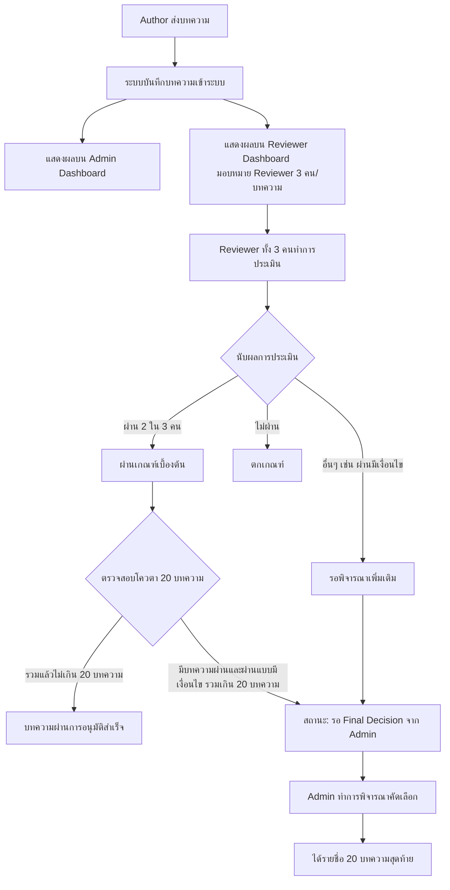

# 📝 ระบบการประเมินบทความ (Article Review Workflow)

เอกสารนี้อธิบายถึงขั้นตอนการทำงานและเงื่อนไข (Logic) หลังจากที่ Author ทำการส่งบทความเข้าสู่ระบบเรียบร้อยแล้ว โดยจะเกี่ยวข้องกับส่วนการแสดงผลของ Admin และการตัดสินใจของ Reviewer

## 1. การแสดงผลเมื่อได้รับบทความใหม่ (Article Distribution)
เมื่อ Author ส่งบทความสำเร็จ บทความจะเข้าสู่ระบบและไปแสดงผลใน 2 ส่วนหลัก:
*   **Admin Dashboard:** แอดมินสามารถมองเห็นบทความทั้งหมดที่ส่งเข้ามา เพื่อติดตามสถานะและภาพรวมของระบบ
*   **Reviewer Dashboard:** บทความจะถูกส่งไปแสดงที่หน้าของ Reviewer ที่ได้รับมอบหมาย โดยแต่ละบทความจะต้องใช้ **Reviewer จำนวน 3 คน** ในการประเมิน

## 2. ขั้นตอนการประเมิน (Review Process)
Reviewer ทั้ง 3 คน จะทำการพิจารณาบทความว่าตรงตามเกณฑ์หรือไม่ โดยผลการประเมินของ Reviewer แต่ละคนจะถูกนำมาคำนวณเพื่อหาข้อสรุป

## 3. เงื่อนไขการตัดสินผล (Decision Logic)
การตัดสินว่าบทความใดจะผ่านการคัดเลือก จะพิจารณาจากผลโหวตของ Reviewer และจำนวนโควตาสูงสุด ดังนี้:

### 3.1 เกณฑ์การผ่านเบื้องต้น (Majority Vote)
*   หากมี Reviewer **2 ใน 3 คน** ให้คะแนนว่า **"ผ่าน"** บทความนั้นจะถือว่า **ผ่านเกณฑ์เบื้องต้นทันที**

### 3.2 เงื่อนไขการคัดเลือก 20 บทความสุดท้าย (Final Decision & Quota)
ระบบมีการตั้งโควตาสำหรับบทความที่จะผ่านเข้ารอบสุดท้ายไว้ที่ **20 บทความ** โดยมีเงื่อนไขการจัดการดังนี้:
*   **บทความที่ "ผ่านแบบมีเงื่อนไข" และกรณีมีบทความผ่านเกินโควตา:** 
    *   หากจำนวนบทความที่ผ่านเกณฑ์เบื้องต้น (ได้ 2 ใน 3 เสียง) **มีจำนวนเกิน 20 บทความ** (หรือรวมกับบทความที่ผ่านแบบมีเงื่อนไขแล้วเกินจำนวน)
    *   ระบบจะทำการส่งมอบอำนาจการตัดสินใจขั้นสุดท้าย (Final Decision) ไปให้กับ **Admin**
    *   **Admin** จะเป็นผู้พิจารณาคัดเลือกและฟันธงบทความจากกลุ่มที่ผ่านและกลุ่มที่ผ่านแบบมีเงื่อนไข เพื่อให้ได้ **20 บทความสุดท้าย** ตามโควตาที่กำหนดไว้

---

## 📊 แผนภาพกระบวนการ (Workflow Flowchart)

